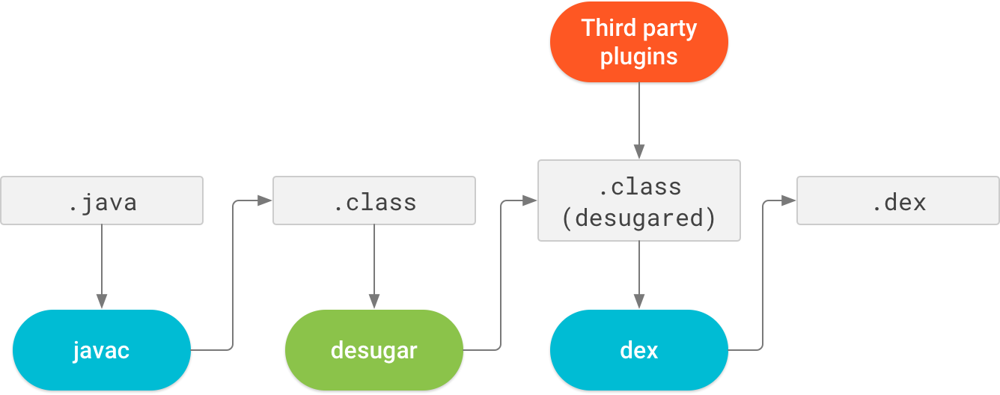

# Android对Java 8的支持
// Settings
ifdef::env-github[]
:note-caption: :paperclip:
:tip-caption: :bulb:
:important-caption: :exclamation:
:caution-caption: :fire:
:warning-caption: :warning:
endif::[]
// TOC
:toc:
:toc-placement: preamble
:toclevels: 3

'''
文章更新历史：

* 2016/8/17 文章发布（Jack版）
* 2017/11/18 更新（JDK版）
* 2020/05/30 更新（AGP 4.0 library desugaring）

'''

:numbered:

## 引子

[NOTE]
====
为了便于表述，本文将使用如下缩写：

* "AS"代表Android Studio
* "AGP"代表Android Gradle Plugin
====

让我们把时间拉回到2016年：随着Android N、AS 2.2和AGP 2.2的发布，Android团队正式宣布支持Java 8的部分语言特性和标准库。
但当时存在一个非常大的问题，新的Jack工具链无法支持基于.class文件（Java字节码）的相关工具和库，包括AS的Instant Run功能。

随着Android团队宣布放弃Jack工具链，以及Android O、AS 3.0和AGP 3.0的发布，Android团队再次宣布对Java 8的支持。
由于这次是基于JDK实现，不再存在之前Jack工具链的问题，支持的语言特性也不再有Android API的限制。

随着AGP 4.0的发布，支持了Java 8 library desugaring，基本完成了对Java 8的全面支持。

请参考支持Java 8的官方文档：
https://developer.android.com/studio/write/java8-support.html 。

TIP: Android团队最初的设想是用收购来的Jack工具链代替JDK，包括对Java 8的支持。
但由于诸多困难，最终还是宣布放弃Jack，重新回到JDK，见官方博客：
https://android-developers.googleblog.com/2017/03/future-of-java-8-language-feature.html 。

## 支持的Java 8语言特性

目前，支持如下Java 8语言特性，并且对Androd API无限制（即可在所有设备上运行）：

* Lambda表达式
* Method引用
* interface支持default method和static method
* Type annotations
* Repeatable annotations

在上面这些语言特性中，最常用的应该是前三个。

### Lambda表达式

我们在设计API时，有时会要求调用者传入一个回调接口。这在支持函数的语言中，很容易实现。
但在Java语言中，由于method无法脱离class独立存在，
只能定义一个只有一个method的interface来实现回调（例如，Runnable）。

在Java 8之前，在调用这类API时，一般做法是实现一个匿名类来实现该interface。
显然，这里的代码是冗余的，我们仅需要这个匿名类的那个唯一method的实现即可。
因此，在Java 8语言中终于引入了被其它语言广泛使用Lambda表达式。

有了Lambda表达式，我们的代码会简化很多，不再需要实现很多匿名类（但编译器可能会自动做这件事）。

例如，在没有Lambda表达式时，我们经常会写出这样的代码：
```java
findViewById(R.id.lambda).setOnClickListener(new OnClickListener() {
    @Override
    public void onClick(View view) {
        new LambdaDemo().showUsage();
    }
});
```

而有了Lambda表达式，我们的代码会变成这样：
```java
findViewById(R.id.lambda).setOnClickListener(iew -> new LambdaDemo().showUsage());
```

#### 语法

关于Lambda表达式的语言细节，可以参见Java官方文档：
https://docs.oracle.com/javase/tutorial/java/javaOO/lambdaexpressions.html

Lambda表达式的语法基本上是这样的：
```java
(type1 param1, type2 param2, ...) -> {statements}
```
其中，参数类型、参数外面的圆括号和方法语句块外面的大括号在某些情况下都是可以省略的，
只要编译器在语法分析时不会产生错误和岐义即可。

这个语言特性看看例子就会了，很容易上手。例如：
```java
executeTask(() -> System.out.println("Hello, world #1"));
executeTask(() -> {
    System.out.print("Hello,");
    System.out.println("world #2");
});

executeTask(a -> a * 2);

executeTask((int lhs, int rhs) -> lhs + rhs);

executeTask((long lhs, long rhs) -> lhs * rhs);
```

### Method引用

假如，我们有如下的API设计：
```java
@FunctionalInterface  // optional
public interface Transformer<F, T> {
    T transform(F obj);
}

public static <F, T> List<T> transform(List<F> list, Transformer<F, T> transformer) {
    ArrayList<T> result = new ArrayList<T>(list.size());
    for (F obj : list) {
        result.add(transformer.transform(obj));
    }
    return result;
}
```

另外，我们也定义了一个Person类：
```java
public static class Person {
    public int age;
    public String name;

    public Person() {}

    private Person(int age) {
        this.age = age;
        this.name = "P-" + age;
    }

    public static Person from(int age) {
        return new Person(age);
    }

    public int compareByAge(Person other) {
        return age - other.age;
    }

    @Override
    public String toString() {
        return "Person[name=" + name + ", age=" + age + "]";
    }
}
```

现在，我们需要根据一个代表age的int列表，生成一个Person列表。那么，代码可能是这样的：
```java
private void showCode() {
    List<Integer> ageList = Arrays.asList(1, 2, 3, 4, 5);
    List<Person> personList = transform(ageList, age -> Person.from(age));
}

private void showCode2() {
    List<Integer> ageList = Arrays.asList(1, 2, 3, 4, 5);
    List<Person> personList = transform(ageList, age -> new Person(age));
}
```

你会发现，虽然用了lambda表达式，代码实现也有点冗余，
因为做的事情仅仅是去调用了另外一个已经存在的method或者constructor。
“Method引用”就是为了解决这样的编码场景，它可以让我们更简单地去引用一些已存在方法。

有了Method引用，上面的代码就可以简化了：
```java
private void showCode() {
    List<Integer> ageList = Arrays.asList(1, 2, 3, 4, 5);
    List<Person> personList = transform(ageList, Person::from);
}

private void showCode2() {
    List<Integer> ageList = Arrays.asList(1, 2, 3, 4, 5);
    List<Person> personList = transform(ageList, Person::new);
}
```

#### 语法

还是先放官方文档：
https://docs.oracle.com/javase/tutorial/java/javaOO/methodreferences.html

Method引用共有4种类型，例举如下：

* 对static method的引用 (ContainingClass::staticMethodName)
* 对一个特定对象的instance method的引用 (containingObject::instanceMethodName)
* 对一个特定类型的任意对象的instance method的引用 (ContainingType::methodName)
* 对constructor的引用 (ClassName::new)

示例代码如下：
```java
private void staticMethod(List<Integer> ageList) {
    // ContainingClass::staticMethodName
    List<Person> personList = transform(ageList, Person::from);
}

private Person createPerson(int age) {
    return Person.from(age);
}

private void instanceMethod(List<Integer> ageList) {
    // containingObject::instanceMethodName
    List<Person> personList = transform(ageList, this::createPerson);
}

private void typeMethod(List<Person> personList) {
    // ContainingType::methodName
    Collections.sort(personList, Person::compareByAge);
}

private void constructor(List<Integer> ageList) {
    // ClassName::new
    List<Person> personList = transform(ageList, Person::new);
}
```

### Default and static interface methods

官方文档：
https://docs.oracle.com/javase/tutorial/java/IandI/defaultmethods.html

在Java 8中，允许为interface添加有具体实现的method（即default method），
并且，**如果仅新增了default method，那么修改后的interface可以和修改前的interface保待二进制兼容**。
有了此特性，Library开发者就可以为interface增加default method，
而不需要Library使用者同步去修改interface的实现代码。

除了default method，还可以在interface中添加static method，
方便把跟该interface相关的static方法放在一起。

示例代码：
```java
interface ItsAnInterface {
    void fun();

    default void foo() {
        System.out.println("foo");
    }

    static void bar(ItsAnInterface a) {
        a.fun();
        a.foo();
    }
}
```

### Repeatable annotations

官方文档：
https://docs.oracle.com/javase/tutorial/java/annotations/repeating.html

Repeatable annotations允许重复使用annotion。例如：
```java
@Schedule(dayOfMonth="last")
@Schedule(dayOfWeek="Fri", hour="23")
public void doPeriodicCleanup() { ... }
```

### Type annotations

官方文档：
https://docs.oracle.com/javase/tutorial/java/annotations/type_annotations.html

在Java 8之前，annotation仅能在声明出现的地方使用，而现在可以在类型出现的地方使用。
（话是这么说，但我还没明白其应用场景。。。）

## 支持的Java 8 API

Android N新增了一些Java 8 API（即这些API只在Android N及更高版本中才可用）。
AGP 4.0通过library desugaring技术，允许开发者在代码中使用这些API，并能够在低版本Android设备上运行
（原理见后解释）。


这些新增API大体可分为两部分。

跟语言特性相关的API：

* java.lang.FunctionalInterface
* java.lang.annotation.Repeatable
* java.lang.reflect.Method.isDefault()
* 跟Repeable annotations相关的反射API，例如AnnotatedElement.getAnnotationsByType(Class)

流式编程相关的API：

* java.util.stream (流式编程)
* java.util.function (函数对象)
* java.lang.Iterable#forEach()

如果想在项目中使用这些Java 8 API，有两种选择：

1. 如果app的minSdkVersion在Android N及更高的版本，则直接使用即可；
2. 如果app的minSdkVersion在Android N之下，则需要使用 AGP 4.0 的『Java 8 library desugaring』特性。

### java.util.stream（流式编程）

跟其它流式编程的方案和API相比，基本上没太大差别，看一个简单的示例代码即可：

```java
class StreamDemo {
    static class Student {
        String name;
        int age;
        double weight;
        int height;

        Student(String name, int age, double weight, int height) {
            this.name = name;
            this.age = age;
            this.weight = weight;
            this.height = height;
        }

        @Override
        public String toString() {
            return "Student[name=" + name + ", age=" + age + ", weight=" + weight
                    + ", height=" + height + "]";
        }
    }

    void showUsage() {
        generateDate().stream()
                .filter(s -> s.age >= 16 && s.age <= 17)
                .map(s -> {
                    s.name = s.name.toLowerCase();
                    return s;
                })
                .sorted((lhs, rhs) -> {
                    int result = lhs.age - rhs.age;
                    if (result != 0) {
                        return result;
                    } else {
                        return rhs.name.compareTo(lhs.name);
                    }
                })
                .forEach(System.out::println);
    }

    private List<Student> generateDate() {
        List<Student> results = new ArrayList<>();
        results.add(new Student("S1", 16, 40.5, 158));
        results.add(new Student("S2", 18, 50, 165));
        results.add(new Student("S3", 17, 43.3, 160));
        results.add(new Student("S4", 16, 42.7, 157));
        results.add(new Student("S5", 15, 45, 163));
        results.add(new Student("S6", 17, 55, 175));
        results.add(new Student("S7", 16, 57, 178));
        results.add(new Student("S8", 15, 48, 167));
        return results;
    }
}
```

### java.util.function （函数对象）

Java 8抽象了很多跟function相关的API，覆盖到了常见的操作。这里看一下 java.util.function.Predicate 的实现代码即可，
顺便也可看到FunctionalInterface、default method、static method打配合的场景。

```java
@FunctionalInterface
public interface Predicate<T> {
    boolean test(T t);

    default Predicate<T> and(Predicate<? super T> other) {
        Objects.requireNonNull(other);
        return (t) -> test(t) && other.test(t);
    }

    default Predicate<T> negate() {
        return (t) -> !test(t);
    }

    default Predicate<T> or(Predicate<? super T> other) {
        Objects.requireNonNull(other);
        return (t) -> test(t) || other.test(t);
    }

    static <T> Predicate<T> isEqual(Object targetRef) {
        return (null == targetRef)
                ? Objects::isNull
                : object -> targetRef.equals(object);
    }
}
```

## Java 8 library desugaring

AGP 4.0带来了
https://developer.android.com/studio/releases/gradle-plugin?buildsystem=cmake#j8-library-desugaring[Java 8 library desugaring] ，
以解决Java 8 API在低版本Android设备中缺失的问题。

实现原理：

1. 在APK包中携带一个额外的dex文件（如classes2.dex），包含了这些Java 8 API的实现，
   但包名前缀由 __java.__ 变为了 __j$.__ （如 java.util.stream.Stream 变为了 j$.util.stream.Stream）。
2. 代码中调用这些Java 8 API的地方也被相应地进行了替换。

这里的技术方案，之前在Android Support Library迁移到Android X时已经被应用过（解决第三方库的兼容性问题）。

也可以预见，将来Java的新API都可以通过library desugaring技术来实现支持。

### 对APK包大小的影响

用本文的demo项目做了简单的测试（AGP 4.0），debug版本中的Java 8 dex文件大小为900KB+，
而启用了R8的release版本中的Java 8 dex文件大小为400KB。
由于APK本身还会压缩，所以对APK大小的影响会更小一些。

### MultiDex

由于用到了MultiDex，在Android 5.0以下的设备中，可能会影响启动速度（如果之前没有使用MultiDex）。

## 启用Java 8

要在项目中启用Java 8，只需要做一点调整即可：
```java
compileOptions {
    sourceCompatibility JavaVersion.VERSION_1_8
    targetCompatibility JavaVersion.VERSION_1_8
}
```

最后，借用一张Android官方文档上的图来解释对Java 8的支持方式：


(原图见 https://developer.android.com/studio/images/write/desugar_2x.png)

### Java 8 library desugaring

贴上官方的示例配置：

[source,java]
----
android {
  defaultConfig {
    // Required when setting minSdkVersion to 20 or lower
    multiDexEnabled true
  }

  compileOptions {
    // Flag to enable support for the new language APIs
    coreLibraryDesugaringEnabled true
    // Sets Java compatibility to Java 8
    sourceCompatibility JavaVersion.VERSION_1_8
    targetCompatibility JavaVersion.VERSION_1_8
  }
}

dependencies {
  coreLibraryDesugaring 'com.android.tools:desugar_jdk_libs:1.0.5'
}
----

## Demo

最后的最后，请参考Demo项目：
https://github.com/ycdev-demo/AndroidJava8Demo 。
